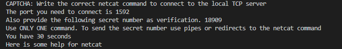

# packet-CAPTCHA

Sets up a TCP server to a random port and expects the correct random password.
The user needs to send the password to the server. If it's correct the program exits. Else it enters an infinite loop. For ease of use (only for humans) netcat binary and help is provided.



# Compile
```
gcc server.c -o server -lws2_32
gcc captcha.c -o captcha
```

Make sure gcc is on PATH and correctly configured.

`nc.exe` is from [here](https://github.com/int0x33/nc.exe/)

Once compiled, run only captcha.exe

## Note

This was made for the [The LaurieWired 2024 Halloween Programming Challenge](https://github.com/LaurieWired/Halloween_2024_Programming_Challenge)